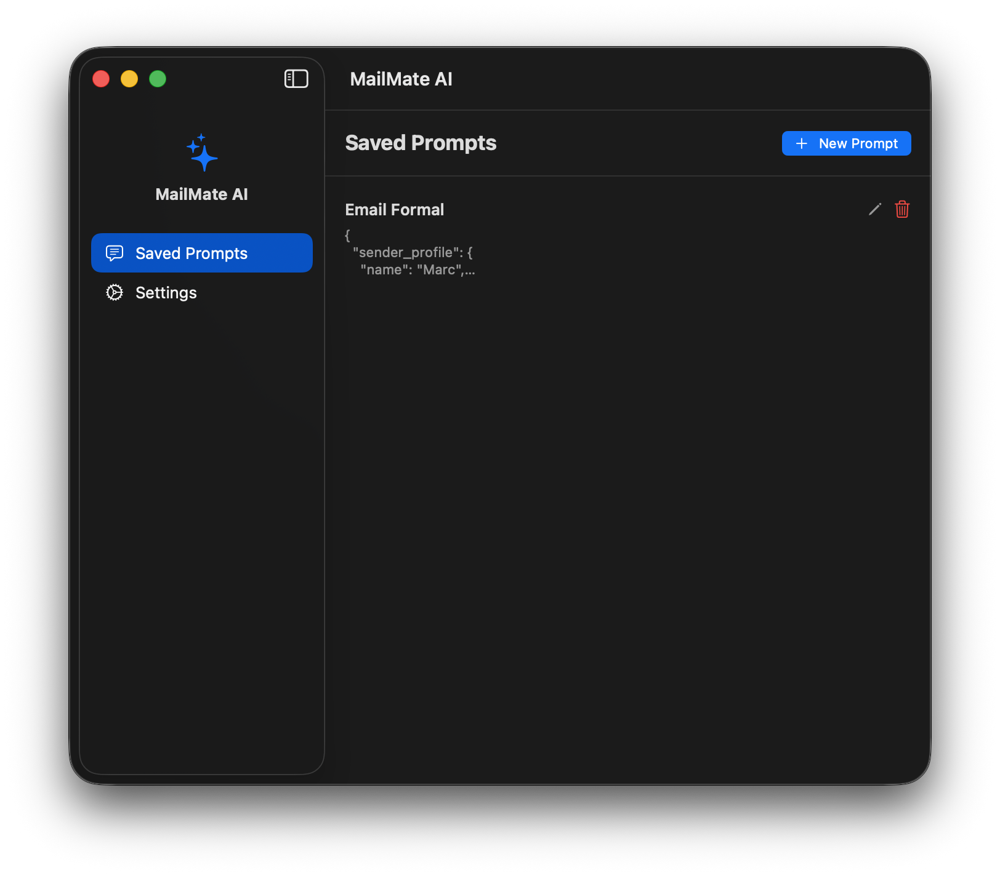
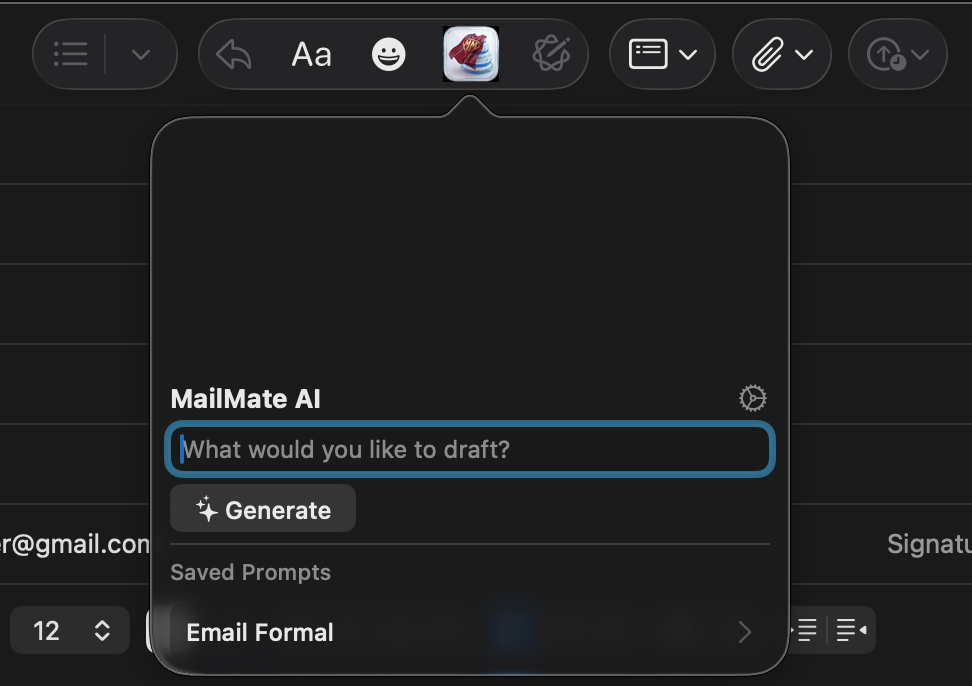

# MailMate AI

> An AI-powered macOS Mail extension that generates email replies directly inside the compose toolbar.

[](https://swift.org)
[](https://www.apple.com/macos)
[](https://aistudio.google.com/app/apikey)
[](#license)

<p align="center">
  
</p>

| Host App -- Manage Saved Prompts | Mail Extension -- Compose Toolbar Panel |
|---|---|
|  |  |

## About

MailMate AI adds a button to Mail.app's compose toolbar. Click it, type an instruction or pick a saved prompt, and the AI generates a contextual reply using the original email. No copy-pasting between apps -- just click, generate, and insert.

## Features

- **Toolbar button in Mail.app** -- opens a panel directly in the compose window
- **Custom instructions** -- type what you want to draft, or pick from saved prompt templates
- **Structured prompts** -- define sender profiles, tone guidelines, talking points, and reply templates in JSON for consistent, context-aware replies
- **Live streaming preview** -- see the reply being generated in real time
- **Iterative refinement** -- ask the AI to tweak the reply ("make it shorter", "add a deadline note")
- **Auto-paste** -- inserts the formatted reply directly into the compose body (with Accessibility permission)
- **Rich formatting** -- replies include proper HTML, hyperlinks, and signature
- **Background generation** -- keeps working even if you click away from the panel
- **Tone matching** -- provide sample emails so the AI learns your writing style

## Requirements

- macOS 14.0 (Sonoma) or later
- A [Google Gemini API key](https://aistudio.google.com/app/apikey) (free tier available)

## Installation

1. Go to the [**Releases**](../../releases/latest) page.
2. Download the latest `.dmg` file.
3. Open the DMG and drag **MailMate AI** into your **Applications** folder.

> **Note:** Since this app is not from the App Store, you may need to right-click the app and select **Open** on the first launch.

### Enable the Mail extension

The extension needs to be enabled in two places:

**System Settings:**
1. Open **System Settings** > **General** > **Login Items & Extensions**
2. Find **MailMate AI** and click the **(i)** info button
3. Toggle on the **Mail Extensions** checkbox

**Mail.app:**
1. Open **Mail** > **Settings** > **Extensions**
2. Enable **MailMate AI Extension**

### Enter your API key

Launch MailMate AI from Applications. The onboarding wizard will ask you to paste your **Gemini API key**. You can get a free key from [Google AI Studio](https://aistudio.google.com/app/apikey).

### Grant Accessibility permission (optional)

For **auto-paste** (so you don't have to press Cmd+V manually):
1. Open **System Settings** > **Privacy & Security** > **Accessibility**
2. Add **MailMate AI** to the list

Without this, the generated reply is copied to your clipboard and you paste it manually.

## Usage

1. **Compose an email** in Mail -- either a new message or a reply.
2. **Click the MailMate AI icon** in the compose toolbar.
3. **Type an instruction** ("Reply professionally and mention the Thursday deadline") or **click a saved prompt**.
4. **Watch the live preview** as the AI generates your reply using the email context.
5. **Refine if needed** -- type "make it shorter" or "add a note about the budget" and click Refine.
6. **Click Insert into Email** -- the formatted reply is pasted directly into the compose body.

## Building from Source

1. Clone the repository:
   ```bash
   git clone https://github.com/marctuinier/mac-mail-llm.git
   ```
2. Create your local build config:
   ```bash
   cd mac-mail-llm/MailMateAI
   cp Local.xcconfig.example Local.xcconfig
   ```
3. Edit `Local.xcconfig` and replace `YOUR_TEAM_ID` with your [Apple Developer Team ID](https://developer.apple.com/account#MembershipDetailsCard).
4. In the [Apple Developer portal](https://developer.apple.com/account/resources/identifiers/list/applicationGroup), create an **App Group** with identifier `<YOUR_TEAM_ID>.group.com.mailmate.ai`.
5. Open `MailMateAI.xcodeproj` in Xcode and build (`Cmd + R`).

Requires Xcode 16+.

## Project Structure

```
MailMateAI/
├── MailMateAI/          # Host app (SwiftUI) -- onboarding, settings, prompt management
├── MailExtension/       # Mail extension (AppKit) -- toolbar panel, Gemini client, generation
└── Shared/              # Shared code -- App Group constants, email context model
```

## License

All rights reserved.
